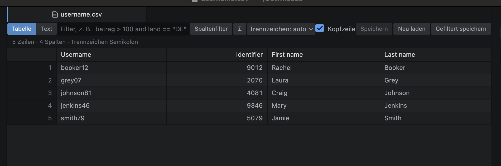

# csv-dataview

Opens CSV, TSV and similar files in Pulsar as a real table instead of plain text —
frozen header, sorting, resizable columns, filters, and in-cell editing. One click
switches back to the normal text view.


[selfReference](https://packages.pulsar-edit.dev/packages/csv-dataview)

## Install

```bash
pulsar -p install csv-dataview
```

Open any `.csv` and it comes up as a table. No TextEditor is created, so there is no
syntax highlighting churning away in the background on large files.

## Usage

| Action | How |
| --- | --- |
| Sort ascending / descending / off | Click the column name |
| Sort by several columns | Shift-click adds a level; the digit shows its rank |
| Resize / auto-fit a column | Drag its right edge / double-click it |
| Move a column | Drag the header sideways |
| Hide a column | Right-click the header |
| Filter everything | Field top left, `ctrl-f` |
| Per-column filter row | `ctrl-shift-f` |
| Edit a cell | Double-click, `Enter` or `F2`; typing a character starts right away |
| Commit an edit | `Enter` moves down, `Tab` moves right, Shift reverses |
| Clear cells / insert row / delete rows | `Del` / `ctrl-alt-n` / `ctrl-alt-r` |
| Undo / redo | `ctrl-z` / `ctrl-shift-z` |
| Save | `ctrl-s` |
| Select a range | Shift-click or Shift + arrows, `ctrl-a` for everything |
| Copy selection / with headers | `ctrl-c` / `ctrl-shift-c` (tab separated, pastes into Excel) |
| Go to row | `ctrl-g` |
| Show a long value in full | `alt-enter` |
| Stats bar on / off | `ctrl-shift-s` |
| Save the filtered result | `ctrl-alt-s`, writes `name.gefiltert.csv` next to the original |
| Switch table ↔ text | `ctrl-alt-t`, the toolbar switch, or the status bar entry |

Sorting follows the column type: numbers numerically (`1.234,56` and `1,234.56` both
work), dates chronologically, everything else alphabetically. Empty cells go last and
ties keep their order from the file.

Delimiter and header row are detected automatically and can be overridden in the
toolbar. External changes reload the view. Sorting, filters, column widths, order and
hidden columns survive a restart of Pulsar.

## Filters

The field at the top left is a small query language. Column names are
case-insensitive; names containing spaces go in square brackets.

```
berlin                              full-text search across all columns
revenue > 1000                      numeric comparison
country == DE and revenue >= 1000   combined
[First Column] contains gmbh        substring
name == "Ber*"                      wildcard
not (country == DE)                 negation
comment is empty                    empty cells, also: is not empty
date >= 2024-01-01                  date comparison
name ~ ^Sch                         regular expression
$3 > 5                              column by number when there is no header
```

Operators are `== = != <> < <= > >= ~ =~ contains startswith endswith matches`,
combined with `and or not` (or `&& || !`) and parentheses. An incomplete expression
tints the field and the status line names the error; nothing is filtered until it
parses.

The per-column fields are shorter: a plain substring by default, otherwise `> 100`,
`<= 5`, `!= open`, `Ber*`, `/^ab/`, `empty` and `!empty`.

## Editing

Changed cells get a coloured stripe, the tab shows the usual unsaved-changes dot, and
Pulsar asks before closing. Saving keeps the delimiter and line ending of the original
file.

Two things worth knowing:

- Nothing is re-filtered or re-sorted after an edit, otherwise the row under your
  cursor would jump away. The next filter run puts it in its place.
- Saving rewrites the whole file with minimal quoting: fields are quoted only when
  they contain a delimiter, a quote or a line break. Redundant quotes from the
  original are gone afterwards. Set `quoteAllOnSave` if you would rather keep
  everything quoted.

## Large files

The file is streamed in 1 MB chunks with progress in the status line, and only the
visible rows plus a small buffer are ever in the DOM, so scrolling stays fast no
matter how long the file is. Column widths are measured once from a sample and then
fixed, so the table does not jitter while you scroll.

Reference figures: 500,000 rows (14 MB) load in about a second, a filter across all
rows takes roughly 340 ms.

Memory is the limit, since every row is held as strings. Files above 256 MB ask before
loading, and `maxRows` caps the row count for anything larger.

## Settings

| Setting | Default | Meaning |
| --- | --- | --- |
| `openAutomatically` | on | open CSV files as a table right away |
| `extensions` | `csv, tsv, tab, psv` | which extensions the table takes over |
| `firstRowIsHeader` | on | treat the first row as the header |
| `rowHeight` | 24 | row height in pixels |
| `maxFileSizeMB` | 256 | size above which loading asks first (0 = never) |
| `maxRows` | 0 | hard row limit (0 = unlimited) |
| `quoteAllOnSave` | off | quote every field when saving |

## Development

```bash
ppm link      # in the package folder
pulsar --dev
ppm test
```

```
lib/csv-parser.js    RFC 4180 parser as a state machine, delimiter and type detection
lib/csv-loader.js    streaming reader with progress and cancellation
lib/query.js         tokenizer and recursive-descent parser for the query language
lib/column-filter.js the short expressions of the per-column filter row
lib/stats.js         aggregates for the stats bar
lib/csv-view.js      the workspace item: virtualised table, sorting, selection, editing
lib/main.js          opener, commands, settings, serialisation
```

## License

MIT


# csv-dataview

Öffnet CSV-, TSV- und ähnliche Dateien in Pulsar als echte Tabelle statt als Textdatei —
mit fixierter Kopfzeile, Sortierung, verschiebbaren Spaltenbreiten, Filterfeld und
Bearbeiten direkt in den Zellen. Ein Klick wechselt jederzeit zur normalen Textansicht.


[selfReference](https://packages.pulsar-edit.dev/packages/csv-dataview)

## Installation

Nach der Veröffentlichung in der Pulsar Package Registry:

```bash
pulsar -p install csv-dataview
```

Vorher oder für eigene Änderungen: den Ordner nach `~/.pulsar/packages/csv-dataview`
kopieren und Pulsar neu starten.

```bash
# Linux / macOS
cp -r pulsar-csv-dataview ~/.pulsar/packages/csv-dataview

# Windows (PowerShell)
Copy-Item -Recurse pulsar-csv-dataview $env:USERPROFILE\.pulsar\packages\csv-dataview
```

Zum Entwickeln stattdessen `ppm link` im Paketordner ausführen und Pulsar mit
`pulsar --dev` starten. Tests laufen mit `ppm test`.

## Bedienung

Eine `.csv` per Doppelklick öffnen — sie erscheint direkt als Tabelle. Es wird kein
TextEditor angelegt, deshalb gibt es auch bei großen Dateien kein Syntax-Highlighting,
das im Hintergrund rechnet.

### Sortieren

| Aktion | Wie |
| --- | --- |
| Auf-/absteigend/aus | Klick auf den Spaltennamen, jeder Klick schaltet weiter |
| Nach mehreren Spalten | Shift-Klick hängt eine weitere Ebene an; die Ziffer im Kopf zeigt die Reihenfolge |
| Gezielt setzen | Rechtsklick auf den Spaltenkopf |
| Alles zurücksetzen | Rechtsklick → Sortierung aufheben |

Sortiert wird nach Spaltentyp: Zahlen numerisch (auch `1.234,56`), Datumsangaben
chronologisch, alles andere alphabetisch mit `Intl.Collator`. Leere Zellen landen
immer am Ende, und bei Gleichstand bleibt die Reihenfolge aus der Datei erhalten.

### Spalten

| Aktion | Wie |
| --- | --- |
| Breite ändern | Rechten Rand im Kopf ziehen |
| An Inhalt anpassen | Doppelklick auf den rechten Rand; Doppelklick auf die Ecke links oben macht alle |
| Verschieben | Spaltenkopf zur Seite ziehen, die Einfügemarke zeigt das Ziel |
| Ausblenden | Rechtsklick → Spalte ausblenden (Statuszeile bietet das Einblenden an) |

### Filtern

| Aktion | Wie |
| --- | --- |
| Gesamtfilter | Feld oben links, `ctrl-f` |
| Filterzeile je Spalte | `ctrl-shift-f` oder Knopf „Spaltenfilter“ |
| Filter löschen | `Escape` im jeweiligen Feld |

Beide Ebenen wirken zusammen: der Gesamtfilter und alle Spaltenfilter müssen zutreffen.

### Bearbeiten

| Aktion | Wie |
| --- | --- |
| Zelle bearbeiten | Doppelklick, `Enter` oder `F2`; ein Zeichen tippen beginnt direkt |
| Eingabe abschließen | `Enter` (eine Zeile tiefer), `Tab` (eine Spalte weiter), Shift kehrt die Richtung um |
| Abbrechen | `Escape` |
| Zellen leeren | `Entf` auf der Auswahl |
| Zeile einfügen | `ctrl-alt-n`, unterhalb der aktiven Zeile |
| Zeilen löschen | `ctrl-alt-r`, auf der Auswahl |
| Rückgängig / Wiederholen | `ctrl-z` / `ctrl-shift-z` |
| Speichern | `ctrl-s` oder der Knopf in der Leiste |

Geänderte Zellen bekommen einen farbigen Streifen, der Reiter zeigt den üblichen Punkt
für ungespeicherte Änderungen, und beim Schließen fragt Pulsar nach. Gespeichert wird
mit dem Trennzeichen und dem Zeilenende der Originaldatei.

Zwei Dinge, die beim Bearbeiten anders sind als erwartet werden könnte:

- Nach einer Änderung wird nicht neu gefiltert oder sortiert, sonst würde die Zeile
  unter dem Cursor wegspringen. Erst der nächste Filtervorgang ordnet neu ein.
- Beim Speichern wird die ganze Datei neu geschrieben, mit minimalem Quoting: Felder
  bekommen nur dann Anführungszeichen, wenn sie Trennzeichen, Anführungszeichen oder
  Umbrüche enthalten. Waren in der Originaldatei überflüssige Anführungszeichen, sind
  sie danach weg. Wer das nicht will, schaltet in den Einstellungen
  `quoteAllOnSave` ein.

### Auswahl, Kopieren, Springen

| Aktion | Wie |
| --- | --- |
| Zelle wählen | Klick, danach Pfeiltasten, `Bild ↑/↓`, `ctrl-Pos1`, `ctrl-Ende` |
| Bereich wählen | Shift-Klick oder Shift + Pfeiltasten, `ctrl-a` wählt alles |
| Auswahl kopieren | `ctrl-c` (tabgetrennt, direkt in Excel einfügbar) |
| … mit Spaltennamen | `ctrl-shift-c` |
| Sichtbare Zeilen als CSV | `ctrl-alt-c` |
| Zu Zeile springen | `ctrl-g` |
| Langen Wert ganz sehen | `alt-enter` |
| Statistik ein/aus | `ctrl-shift-s` oder der Σ-Knopf |
| Gefiltert speichern | `ctrl-alt-s`, legt `name.gefiltert.csv` daneben |
| Neu laden | `F5` |
| Zwischen Tabelle und Text wechseln | `ctrl-alt-t`, der Umschalter links in der Leiste, oder der Eintrag in der Statusleiste |

Die Σ-Leiste zeigt für die aktive Spalte oder die markierte Auswahl Anzahl, leere
Zellen, eindeutige Werte und bei Zahlen Summe, Mittelwert, Minimum und Maximum.
Über 500.000 Zellen wird erst auf Knopfdruck gerechnet, damit nichts hängt.

Der Umschalter oben links wechselt in die normale Textansicht und zurück; dasselbe
liegt als Eintrag in der Statusleiste, damit der Weg zurück auch aus dem TextEditor
heraus da ist. Stehen ungespeicherte Änderungen an, fragt Pulsar vor dem Wechsel.

Trennzeichen und Kopfzeile werden automatisch erkannt, lassen sich in der Leiste
oben aber jederzeit umstellen. Ändert sich die Datei auf der Platte, lädt die Ansicht
automatisch neu. Sortierung, Filter, Spaltenbreiten, -reihenfolge und ausgeblendete
Spalten überleben einen Neustart von Pulsar.

## Filtersprache

Das Feld oben links ist eine kleine Abfragesprache. Spaltennamen sind
Groß-/Kleinschreibung-egal; Namen mit Leerzeichen kommen in eckige Klammern.

```
berlin                              Volltextsuche über alle Spalten
umsatz > 1000                       numerischer Vergleich
land == DE and umsatz >= 1000       Verknüpfung
[Erste Spalte] contains gmbh        Teilstring
name == "Ber*"                      Platzhalter
status != offen or prio == 1        oder
not (land == DE)                    negieren
kommentar is empty                  leere Zellen
kommentar is not empty
datum >= 2024-01-01                 Datumsvergleich
name ~ ^Sch                         regulärer Ausdruck
$3 > 5                              Spalte per Nummer, wenn es keine Kopfzeile gibt
```

Operatoren: `== = != <> < <= > >= ~ =~ contains startswith endswith matches`,
Verknüpfung mit `and or not` bzw. `&& || !` und Klammern. Zahlen werden in beiden
Schreibweisen verstanden (`1.234,56` und `1,234.56`), Datumsangaben als
`2024-01-31`, `31.01.2024` und `01/31/2024`.

Ist der Ausdruck unvollständig, färbt sich das Feld und die Statuszeile nennt den
Fehler — gefiltert wird dann nicht.

Die Felder in der Spaltenfilterzeile sind bewusst kürzer gehalten: ohne Operator wird
als Teilstring gesucht, sonst gehen `> 100`, `<= 5`, `!= offen`, `Ber*`, `/^ab/`
sowie `empty` und `!empty`.

## Große Dateien

* Die Datei wird in 1-MB-Blöcken gestreamt, der Fortschritt steht in der Statuszeile.
* Gerendert werden nur die sichtbaren Zeilen plus ein kleiner Puffer, egal wie lang
  die Datei ist. Scrollen bleibt dadurch konstant schnell.
* Spaltenbreiten werden einmal aus einer Stichprobe berechnet und dann festgehalten
  (`table-layout: fixed`), damit die Tabelle beim Scrollen nicht springt.
* Ab 256 MB fragt das Paket vor dem Laden nach; die Grenze steht in den Einstellungen.
* Referenzwert auf einem Testrechner: 500.000 Zeilen (14 MB) in etwa einer Sekunde
  eingelesen, ein Filter über alle Zeilen in rund 340 ms.

Der begrenzende Faktor ist der Arbeitsspeicher, weil alle Zeilen als Strings gehalten
werden. Für Dateien im Gigabyte-Bereich hilft `Maximale Zeilenzahl` in den
Einstellungen: dann wird nach n Zeilen abgebrochen und die Statuszeile weist darauf hin.

## Einstellungen

| Einstellung | Standard | Bedeutung |
| --- | --- | --- |
| `openAutomatically` | an | CSV-Dateien direkt als Tabelle öffnen |
| `extensions` | `csv, tsv, tab, psv` | welche Endungen die Tabelle übernimmt |
| `firstRowIsHeader` | an | erste Zeile als Kopfzeile deuten |
| `rowHeight` | 24 | Zeilenhöhe in Pixeln |
| `maxFileSizeMB` | 256 | ab welcher Größe nachgefragt wird (0 = nie) |
| `maxRows` | 0 | harte Obergrenze an Zeilen (0 = unbegrenzt) |
| `quoteAllOnSave` | aus | beim Speichern jedes Feld in Anführungszeichen setzen |

## Aufbau

```
lib/csv-parser.js   RFC-4180-Parser als Zustandsautomat, Trennzeichen- und Typerkennung
lib/csv-loader.js   Streaming über fs.createReadStream, Fortschritt und Abbruch
lib/query.js        Tokenizer und Recursive-Descent-Parser der Filtersprache
lib/column-filter.js  die kurzen Ausdrücke der Spaltenfilterzeile
lib/stats.js        Aggregate für die Σ-Leiste
lib/csv-view.js     das Workspace-Item: virtualisierte Tabelle, Sortierung, Auswahl
lib/main.js         Opener, Befehle, Einstellungen, Serialisierung
```

Die Ansicht ist ein reguläres Workspace-Item: sie überlebt einen Neustart von Pulsar
inklusive Filter und Sortierung, lässt sich in Panes ziehen und teilen.

## Lizenz

MIT

## Veröffentlichen

Vor dem ersten `pulsar -p publish` müssen in `package.json` `repository`, `author`
und `bugs` auf das eigene GitHub-Repository zeigen, und das Repository muss
öffentlich und gepusht sein. `version` steht bis dahin auf `0.0.0`; die erste
echte Version vergibt ppm.

```bash
pulsar -p login              # einmalig, legt den API-Token im Schlüsselbund ab
pulsar -p publish minor      # 0.0.0 -> 0.1.0, taggt, pusht und registriert
```

Ob der Name noch frei ist, zeigt
`https://packages.pulsar-edit.dev/packages/csv-dataview`.
